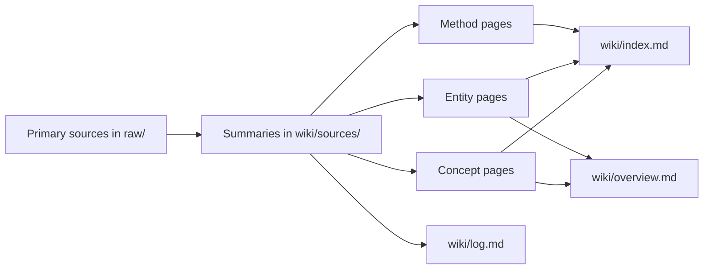

# karpathy-wiki

A research wiki compiled from Andrej Karpathy's public corpus: X posts, talks, interviews, self-bio, and related artifacts. The goal is not just to archive links, but to distill Karpathy's worldview into a source-grounded, cross-linked knowledge base that can keep compounding over time.

> [!NOTE]
> This repository follows the LLM-maintained wiki pattern Karpathy described in [LLM Knowledge Bases](wiki/sources/karpathy-x-2026-llm-wiki.md): source material lands in `raw/`, an LLM incrementally compiles it into structured markdown under `wiki/`, and the compiled wiki becomes the substrate for future synthesis, querying, and maintenance.

> [!IMPORTANT]
> Treat `raw/` as immutable primary material. The editable layer is `wiki/`, and structural changes should be reflected in [wiki/index.md](wiki/index.md), [wiki/log.md](wiki/log.md), and, when needed, [wiki/overview.md](wiki/overview.md).

**Quick links:** [Start Here](#start-here) · [Workflow](#workflow) · [Corpus Snapshot](#corpus-snapshot) · [Repository Structure](#repository-structure) · [How To Use It](#how-to-use-it)

## Start Here

- [Overview](wiki/overview.md): top-level synthesis of the entire corpus
- [Andrej Karpathy](wiki/entities/andrej-karpathy.md): the main hub page for Karpathy's career arc, recurring positions, and tracked coinages
- [Index](wiki/index.md): catalog of every source, concept, entity, and method page
- [Log](wiki/log.md): append-only record of ingests and structural updates
- [CLAUDE.md](CLAUDE.md): the maintenance protocol for the LLM agent that operates on the wiki

Useful entry paths depending on what you want:

- Karpathy's overall worldview: [Overview](wiki/overview.md)
- software / agents thesis: [Software Is Changing (Again)](wiki/sources/software-is-changing-again.md), [Agentic Engineering](wiki/concepts/agentic-engineering.md), [Verifiability](wiki/concepts/verifiability.md)
- product and workflow ideas: [Build for Agents](wiki/concepts/build-for-agents.md), [Autonomy Slider](wiki/concepts/autonomy-slider.md), [LLM Knowledge Bases](wiki/concepts/llm-knowledge-bases.md)
- LLM psychology frame: [Animals vs Ghosts](wiki/concepts/animals-vs-ghosts.md), [People Spirits](wiki/concepts/people-spirits.md), [AI Psychosis](wiki/concepts/ai-psychosis.md)
- pedagogy ladder: [Ramps to Knowledge](wiki/concepts/ramps-to-knowledge.md), [micrograd](wiki/entities/micrograd.md), [nanoGPT](wiki/entities/nanogpt.md), [llm.c](wiki/entities/llm-c.md), [nanochat](wiki/entities/nanochat.md)

## Workflow

The maintenance loop is:

1. Capture source material into `raw/`.
2. Keep `raw/` immutable once ingested.
3. Have an LLM read the source and create or update a page in `wiki/sources/`.
4. Update the related concept, entity, method, comparison, or synthesis pages in `wiki/`.
5. Refresh [wiki/index.md](wiki/index.md), append [wiki/log.md](wiki/log.md), and revise [wiki/overview.md](wiki/overview.md) when the big picture changes.

The operating assumption is that the wiki, not the raw corpus, is the primary interface for understanding the material. Queries should usually begin from `wiki/index.md` or `wiki/overview.md`, then drill back into source summaries and finally raw files when needed.

## Corpus Snapshot

Current coverage:

- [x] 2024 foundation material such as the Berkeley AI Hackathon keynote and GPU MODE IRL talk
- [x] the full April-December 2025 X-post arc, including Software 3.0, verifiability / RLVR, build-for-agents, LLM psychology, AI-assisted coding, Tesla FSD, and nanochat
- [x] the January-April 2026 X-post arc, including agentic engineering, bacterial code, agent networks, Claws, autoresearch, supply-chain attacks, LLM knowledge bases, and BYOAI
- [x] Karpathy's self-bio and long-form interview material used to ground career history and recurring themes

As of 2026-04-18, the repository contains[^snapshot]:

| Layer | Count |
|------|------:|
| Raw markdown files | 109 |
| Source-summary pages | 31 |
| Concept pages | 50 |
| Entity pages | 43 |
| Method pages | 1 |

`raw/` does not map 1:1 to `wiki/sources/`.[^bundles]

## Repository Structure

| Path | Role |
|------|------|
| `raw/` | Immutable source material. This includes X-post captures, transcripts, self-bio notes, and other primary documents. |
| `raw/2025/`, `raw/2026/` | Date-organized Karpathy X-post corpus. |
| `raw/youtube-transcript/` | Long-form talk and interview transcripts plus transcript metadata. |
| `wiki/sources/` | Faithful summaries of individual sources or source bundles. This is the bridge from primary material into the wiki. |
| `wiki/concepts/` | Cross-source idea pages such as `verifiability`, `agentic-engineering`, `bacterial-code`, and `llm-knowledge-bases`. |
| `wiki/entities/` | People, companies, products, protocols, projects, and courses that recur across the corpus. |
| `wiki/methods/` | Technique-level pages when a method deserves its own treatment. |
| `wiki/index.md` | Main navigation layer for humans and agents. |
| `wiki/log.md` | Audit trail of ingests, bulk updates, and structural changes. |
| `wiki/overview.md` | Most compressed synthesis of the whole repository. |
| `CLAUDE.md` | Rules of operation for the LLM maintainer. |

What each page type is for

- `wiki/sources/` preserves what a source said
- `wiki/concepts/` explains how recurring ideas evolve across sources
- `wiki/entities/` anchors the people, products, and projects that ideas attach to
- `wiki/overview.md` is the most opinionated high-level synthesis
- `wiki/log.md` is the provenance layer that explains how the wiki got to its current state

## How To Use It

- Open the repository as an Obsidian vault if you want the best browsing experience for wikilinks and graph navigation.
- Read [CLAUDE.md](CLAUDE.md) before asking an agent to ingest, lint, or reorganize the wiki.
- Treat `raw/` as read-only primary material and `wiki/` as the editable compiled layer.
- Use [wiki/index.md](wiki/index.md) as the canonical map of what has already been ingested.
- Use [wiki/log.md](wiki/log.md) if you want to see when a theme or section entered the repository.

> [!TIP]
> Open the repository as an Obsidian vault for the best experience with wikilinks, backlinks, and graph navigation.

Scaffolded with [`llm-wiki-bootstrap`](https://github.com/nanzhipro/Karpathy-llm-wiki-bootstrap-skill), then substantially extended around the Karpathy corpus.

[^snapshot]: These counts reflect the repository state on 2026-04-18 and will change as the wiki grows.
[^bundles]: Many individual 2025 and 2026 X-post files are intentionally clustered into thematic source bundles so the wiki tracks ideas at the level Karpathy actually develops them, rather than at a one-post-per-page granularity.
