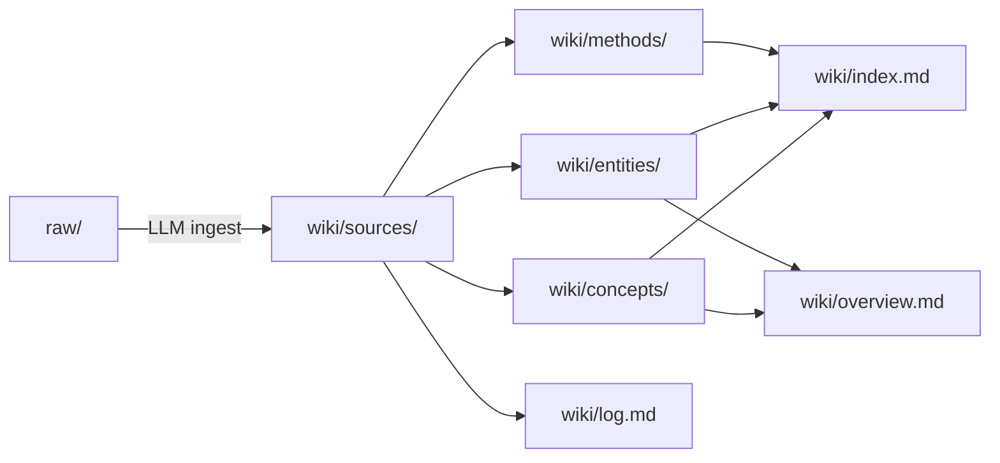

# karpathy-wiki

> A source-driven knowledge base distilled from Andrej Karpathy's public corpus — X posts, interviews, talks, open-source repos, and self-bio.
> **The goal isn't to archive links; it's to understand the person** — how he thinks, how he learns, how he works, what he believes, what he's built, and what he's saying about AI and software engineering.

The repo follows the pattern Karpathy himself sketches in [LLM Knowledge Bases](wiki/sources/karpathy-x-2026-llm-wiki.md): raw material goes into `raw/` (read-only), an LLM compiles it into `wiki/` (read-write, refactored freely), and the compiled wiki becomes the substrate for future queries and ingests.

> [!IMPORTANT]
> Enter through `wiki/`, not `raw/`. [`wiki/overview.md`](wiki/overview.md) is the highest-compression synthesis; [`wiki/index.md`](wiki/index.md) is the full catalog.

---

## Quick Paths

| I want to… | Start here |
|---|---|
| See the whole synthesis | [wiki/overview.md](wiki/overview.md) |
| Read Karpathy's bio and body of work | [wiki/entities/andrej-karpathy.md](wiki/entities/andrej-karpathy.md) |
| Browse the full catalog | [wiki/index.md](wiki/index.md) |
| Understand the maintenance protocol | [CLAUDE.md](CLAUDE.md) |
| Read in Obsidian | Open this directory as a vault |

---

## 1. Meet the Person

> "I like to train deep neural nets on large datasets 🧠🤖💥" — karpathy.ai self-intro

Karpathy is one of the most **paradigm-shaping** individuals in modern AI. He doesn't ship the biggest models; he gives us the **vocabulary** to reason about them (Software 3.0, people spirits, animals vs ghosts, cognitive core, march of nines…). Researcher, engineer, teacher, public thinker — four hats at once, which almost nobody else wears simultaneously.

**Career arc** ([full table](wiki/entities/andrej-karpathy.md#career-arc-verified-dates-from-self-bio)):

- 2005–2015: Toronto (Hinton's course) → UBC → Stanford (under Fei-Fei Li)
- 2011 / 2013 / 2015: Google Brain → Google Research → DeepMind internships
- 2015–2017: **OpenAI founding member**
- 2017–2022: **Tesla Director of AI**, leading the Autopilot vision team
- 2023–2024: Back to OpenAI, working on midtraining and synthetic data
- 2024– : Independent educator; founded [Eureka](wiki/entities/eureka.md)

**What he's left behind:**
- [CS231n](wiki/entities/cs231n.md) — Stanford's first deep-learning course, which funneled a generation into DL (150 students in 2015 → 750 in 2017)
- [Zero to Hero](wiki/entities/zero-to-hero.md) — the most watched from-scratch neural-net series on YouTube
- [nanoGPT](wiki/entities/nanogpt.md) / [nanochat](wiki/entities/nanochat.md) / [micrograd](wiki/entities/micrograd.md) / [llm.c](wiki/entities/llm-c.md) / [microGPT](wiki/entities/microgpt.md) — a ladder of minimal, legible, high-fidelity teaching code
- Tesla FSD — the 2026-01-01 coast-to-coast run (2,732 miles, zero interventions) is the cleanest public proof of the [Software 2.0](wiki/concepts/verifiability.md) bet

---

## 2. How He Thinks

Five observable traits:

### 1. Frame-first
He **coins a word**, then uses it as reasoning scaffolding. The term isn't a label applied after the fact — it's the analysis tool. Each coinage comes packaged with its own analogies, counterexamples, and evolutionary edges. This is the technical core of his influence.

Full coinage list in [andrej-karpathy.md](wiki/entities/andrej-karpathy.md#karpathys-coinages-tracked-in-this-wiki). The load-bearing ones:

| Frame | Question it answers |
|---|---|
| [Software 1.0/2.0/3.0](wiki/concepts/software-3-0.md) | How does software get written? |
| [Animals vs Ghosts](wiki/concepts/animals-vs-ghosts.md) | What kind of thing is an LLM? |
| [People Spirits](wiki/concepts/people-spirits.md) | What are an LLM's psychological quirks? |
| [March of Nines](wiki/concepts/march-of-nines.md) | Why is autonomy — self-driving, agents — so slow? |
| [Verifiability](wiki/concepts/verifiability.md) | Which tasks can AI actually automate? |
| [Cognitive Core](wiki/concepts/cognitive-core.md) | What's the "right" model size? |
| [Jagged Intelligence](wiki/concepts/jagged-intelligence.md) | Why is an LLM genius and moron by turns? |
| [Verification Gap](wiki/concepts/verification-gap.md) | Where does agentic coding bottleneck? |

### 2. Analogy-driven
- Tesla / Waymo autonomy curve → the coming arc of coding agents
- *Memento* / *50 First Dates* → LLM session-level amnesia
- *Rain Man* → savant memory paired with cognitive gaps
- Horizontal gene transfer in bacteria → the portability of [bacterial code](wiki/concepts/bacterial-code.md)
- Iron Man suit vs Iron Man robot → [augmentation over automation](wiki/concepts/iron-man-analogy.md)

Analogies aren't ornament — they're how he compresses **mechanism-level intuition**.

### 3. Slopes, not points
He says it repeatedly: "5–10x **more pessimistic** than people expect **now**, 5–10x **more optimistic** than people expect **in 10 years**" ([Dwarkesh 2025 recap](wiki/sources/karpathy-x-2025-dwarkesh-recap.md)). He reasons about **derivatives**, not instantaneous values.

### 4. Distrust benchmarks, trust vibes
In 2025 he names the [leaderboard illusion](wiki/sources/karpathy-x-2025-evals-and-model-vibes.md): benchmark scores have decoupled from lived experience. He trusts **model smell**, [OpenRouter](wiki/entities/openrouter.md) usage share, and multi-model councils ([llm-council](wiki/entities/llm-council.md)) instead.

### 5. Argue the opposite
In 2026 he states it explicitly: "**Before I commit to a conclusion, I force myself to argue the opposite.**" Contradictions and uncertainty are kept as signal, not smoothed over. This is the methodological reason his public calls rarely age badly.

---

## 3. How He Learns

> "Pedagogy is a ramp, not a cliff."

Six principles:

1. **[10,000 hours](wiki/concepts/10000-hours.md).** No shortcuts. But ramps raise the information density per hour.
2. **[Ramps to Knowledge](wiki/concepts/ramps-to-knowledge.md).** Attack any complex idea with a **minimal but complete** implementation: micrograd → nanoGPT → nanochat → llm.c. Each rung strips scaffolding and feeds the next.
3. **Build it to feel it** ([Feel the AGI](wiki/concepts/feel-the-agi.md)). Don't read AGI takes — train a tiny model and watch the loss curve. This is his prescribed **mode of knowing**, not just a hobby.
4. **Physics is the bootloader.** "Children should learn physics early not because they go on to do physics, but because it is the subject that best boots up a brain. Physicists are the intellectual embryonic stem cell." ([Dwarkesh recap](wiki/sources/karpathy-x-2025-dwarkesh-recap.md))
5. **LLM as second reader, not first** ([Reader3](wiki/entities/reader3.md) workflow). Read the primary text yourself; then ask the LLM for explanation, background, or pushback — not the other way around. This is the bulwark against [atrophy](wiki/concepts/atrophy.md).
6. **[Publish everything](wiki/concepts/snowballs.md).** Courses, repos, videos, posts — all public, all free. The flywheel (exposure → feedback → improvement → more exposure) is the whole point.

---

## 4. His Worldview

Seven hard positions, each reinforced across multiple sources:

1. **LLMs are ghosts, not animals.** We aren't recreating biological intelligence; we're summoning digital entities by imitating human text. Don't use animal evaluations. Don't expect instinctual drives. [animals-vs-ghosts](wiki/concepts/animals-vs-ghosts.md)

2. **Power to the people** (2025-04-08 pinned post). LLMs invert the usual diffusion path — where it once went military → enterprise → consumer, this time **individuals benefit first.** The reason: the LLM capability shape (broad, shallow-to-middling expertise across many domains) fits an individual, not an org. [power-to-the-people](wiki/concepts/power-to-the-people.md)

3. **Decade of agents, not year of agents.** Most people get the two-year and ten-year horizons backwards: pessimistic at two years (it's slower than the hype), optimistic at ten (it's deeper than the skeptics claim). [decade-of-agents](wiki/concepts/decade-of-agents.md)

4. **Verifiability is the Software 2.0 automation predicate** (2025-11-17). "Software 1.0 automates what you can **specify**. Software 2.0 automates what you can **verify**." His single most load-bearing sentence of 2025. [verifiability](wiki/concepts/verifiability.md)

5. **[RLVR](wiki/concepts/rlvr.md) is the #1 paradigm shift of 2025** — and yet [RL is still terrible](wiki/concepts/rl-is-terrible.md) ("sucking supervision through a straw"). The next move should be [system prompt learning](wiki/concepts/system-prompt-learning.md).

6. **Capability is peaky / jagged.** Progress isn't uniform. A good eval tells you **where the peaks and pits are.** [peaky-capability](wiki/concepts/peaky-capability.md) · [jagged-intelligence](wiki/concepts/jagged-intelligence.md)

7. **The supply chain is the new attack surface.** Flagged via [prompt injection](wiki/concepts/prompt-injection.md) from 2025-07-11 onward; vindicated by the 2026 litellm and axios incidents. The [bacterial-code](wiki/concepts/bacterial-code.md) aesthetic and [supply-chain attacks](wiki/concepts/supply-chain-attacks.md) worry are two sides of the same coin.

---

## 5. How He Works

- **[Autonomy Slider](wiki/concepts/autonomy-slider.md).** Both products and his own workflow keep a tunable level of autonomy: Cursor tab (~75% of the time) → highlight-edit → [Claude Code](wiki/entities/claude-code.md) → GPT-5 Pro, scaling with task difficulty.
- **[Bacterial Code](wiki/concepts/bacterial-code.md).** Small, self-contained, dependency-free, rippable. He rejects the classical "dependencies are bricks for pyramids" view; in the LLM era, the **cost/benefit of pulling in a dep has changed.**
- **Parallel agents + hand-editing in the IDE** ([agentic engineering](wiki/concepts/agentic-engineering.md), Jan 27 2026). Multiple Claude Code sessions on the left, the IDE on the right for reading and patching. Not pure delegation — **orchestration + review.**
- **[Code Post-Scarcity](wiki/concepts/code-post-scarcity.md)** (2025-10-27). Writing code is no longer the expensive part. Thousand-line throwaway visualizations are now routine.
- **[Build for Agents](wiki/concepts/build-for-agents.md).** Markdown docs, CLI-first, MCP-exposed capabilities. "LLMs scrape, they don't navigate."
- **Publish everything.** No private Google Docs. Just X posts, GitHub repos, YouTube videos — a personal embodiment of the [BYOAI](wiki/concepts/byoai.md) ethic.

---

## 6. What He's Built

### Six domains of contribution

1. **Popularizing computer vision** — CS231n (2015–2017) and being a first-author force on Stanford's ImageNet work (famously "the reference human for ImageNet").
2. **Software 2.0 for self-driving** — Tesla Autopilot 2017–2022, swapping C++ modules for neural nets layer by layer. The 2026-01-01 coast-to-coast is the public payoff.
3. **Opening the LLM training stack** — [nanoGPT](wiki/entities/nanogpt.md) / [nanochat](wiki/entities/nanochat.md) / [llm.c](wiki/entities/llm-c.md) turn frontier training into a legible, reproducible, sub-$100 exercise.
4. **Midtraining and synthetic data** (OpenAI 2023–24) — not detailed publicly, but visible in shadows (e.g. nanochat's identity-injection recipe on [10.21](wiki/sources/karpathy-x-2025-nanochat-saga.md)).
5. **Shaping the public vocabulary** — Software 3.0, people spirits, animals vs ghosts, vibe coding, agentic engineering, bacterial code, BYOAI. Six-plus terms that have become working-language in the field.
6. **Restarting AI education** — [Eureka](wiki/entities/eureka.md), "Starfleet Academy for the mind," aiming to generalize the ramps-to-knowledge pattern into public infrastructure.

### Key dates

- **2025-04-08** [Power to the People](wiki/sources/karpathy-x-2025-power-to-the-people.md) — the diffusion-inversion thesis
- **2025-07-06** [Bacterial code](wiki/sources/karpathy-x-2025-bacterial-code-origin.md) — coinage
- **2025-07-27** [Cognitive core](wiki/sources/karpathy-x-2025-cognitive-core.md) — full spec
- **2025-10-13** [nanochat](wiki/sources/karpathy-x-2025-nanochat-saga.md) released
- **2025-11-17** [Verifiability](wiki/sources/karpathy-x-2025-software-paradigm.md) — the defining sentence
- **2025-12-20** [Year-in-review](wiki/sources/karpathy-x-2025-software-paradigm.md) — [RLVR](wiki/concepts/rlvr.md) declared #1 paradigm shift
- **2026-01-01** [Tesla FSD coast-to-coast](wiki/sources/karpathy-x-2026-fsd-coast-to-coast.md) (2,732 miles, 0 interventions)
- **2026-01-27** [Claude coding notes](wiki/sources/karpathy-x-2026-claude-coding-reflections.md) — [atrophy](wiki/concepts/atrophy.md) named
- **2026-02-05** [Agentic engineering](wiki/concepts/agentic-engineering.md) — coinage
- **2026-02-25** "The phase shift happened in December 2025" — stated plainly
- **2026-04-05** [BYOAI](wiki/concepts/byoai.md) — the personal-AI-stack stance

---

## 7. Views on AI × Software Engineering

The layer you'll most likely use day-to-day. Nine pillars:

1. **[Software 3.0](wiki/concepts/software-3-0.md).** Prompts are the new source code; English is the new programming language. But writing the code is the easy part — the hard part is the **DevOps crunch** ([MenuGen took a week to ship](wiki/concepts/vibe-coding.md)).
2. **[Partial-Autonomy Apps](wiki/concepts/partial-autonomy-apps.md).** The next product shape: half-autonomous apps with an [autonomy slider](wiki/concepts/autonomy-slider.md). Cursor, Perplexity, Claude Code, Codex are all early exemplars.
3. **[Build for Agents](wiki/concepts/build-for-agents.md).** Markdown docs, CLI, API, [MCP](wiki/entities/model-context-protocol.md); `llms.txt`; [LLM GUI](wiki/concepts/llm-gui.md) as a **not-yet-built-but-foreseeable** frontend paradigm.
4. **[Agentic Engineering](wiki/concepts/agentic-engineering.md).** The professionalized sibling of vibe coding. December 2025 is the threshold: before it, coding agents mostly didn't work; after it, they mostly do.
5. **[Verification Gap](wiki/concepts/verification-gap.md).** Generation is cheap, verification is expensive — that's the new bottleneck. The code volume isn't the problem; review throughput is. One consequence: [atrophy](wiki/concepts/atrophy.md) — our generation muscles shrink before review muscles grow in.
6. **[Code Post-Scarcity](wiki/concepts/code-post-scarcity.md).** Code is cheap enough to be one-shot and disposable. The old DRY / early-abstraction / helper-function instincts **invert in throwaway territory.**
7. **[Context Engineering](wiki/concepts/context-engineering.md).** The successor concept to "prompt engineering" — context selection, compression, ordering, memory, tools. Broader and more operational.
8. **[Bacterial Code](wiki/concepts/bacterial-code.md) × [Supply Chain Attacks](wiki/concepts/supply-chain-attacks.md).** The 2026 litellm / axios incidents show it plainly: **fewer deps means less attack surface.** LLMs tilt the math toward "yoink and inline" over "pip install."
9. **[BYOAI](wiki/concepts/byoai.md).** Your AI stack should live **on your side** — runnable locally, model-swappable, resilient to [intelligence brownouts](wiki/concepts/intelligence-brownouts.md). The natural extension is [cognitive core](wiki/concepts/cognitive-core.md): small, reasoning-first, tool-using.

Pair with the 11 central claims in [wiki/overview.md](wiki/overview.md#central-claims-across-the-corpus) for the most-compressed version of the same story.

---

## Repository Structure

| Path | Purpose |
|---|---|
| `raw/` | Immutable source material (X posts, transcripts, self-bio) |
| `raw/2025/` · `raw/2026/` | X-post corpus organized by year |
| `raw/youtube-transcript/` | Long-form interview and talk transcripts |
| `wiki/sources/` | Faithful per-source (or per-bundle) summaries |
| `wiki/concepts/` | Cross-source concept pages |
| `wiki/entities/` | People / orgs / products / projects / courses |
| `wiki/methods/` | Algorithm and technique pages |
| `wiki/index.md` | Full catalog |
| `wiki/log.md` | Audit log of ingests, lints, refactors |
| `wiki/overview.md` | Highest-compression synthesis |
| `CLAUDE.md` | Maintenance protocol for the LLM |

**Workflow:**

## Corpus Snapshot

As of 2026-04-18:

| Layer | Count |
|---|---:|
| Raw markdown files | 109 |
| Source summaries | 31 |
| Concept pages | 50 |
| Entity pages | 43 |
| Method pages | 1 |

**Covered:** 2024 foundations (Berkeley / GPU MODE) · full 2025 X-post arc (16 thematic bundles) · 2026 X-post arc through April (10 thematic bundles) · self-bio and long-form transcripts.

`raw/` and `wiki/sources/` aren't 1:1 — high-density short posts are **clustered by theme** into bundled source pages, matching the grain at which Karpathy actually develops ideas.

---

## How to Use

- **Read it as a wiki.** Open the repo as an Obsidian vault and use the graph view to see concept adjacency.
- **Add to it.** To ingest new material, follow the ingest protocol in [CLAUDE.md](CLAUDE.md).
- **Query against it.** Aim queries at `wiki/`, not `raw/` — the former is compiled and cross-linked; the latter is the unprocessed firehose.
- **Use it for writing or thinking.** Every concept page's `## Related` section maps its neighborhood; [wiki/overview.md](wiki/overview.md) gives the big picture.
- **Read it as a timeline.** [log.md](wiki/log.md) records the wiki's own evolution — every ingest, lint, and refactor leaves a trace.

> [!TIP]
> **5 minutes:** read [wiki/overview.md](wiki/overview.md).
> **30 minutes:** add [wiki/entities/andrej-karpathy.md](wiki/entities/andrej-karpathy.md) and [wiki/concepts/software-3-0.md](wiki/concepts/software-3-0.md).
> **A full day:** walk the seven sections of this README in order.

---

Scaffolded with [`llm-wiki-bootstrap`](https://github.com/nanzhipro/Karpathy-llm-wiki-bootstrap-skill); extended substantially around 69+ 2025 X posts, 15+ 2026 X posts, 4 long-form talks/interviews, and the karpathy.ai self-bio.
