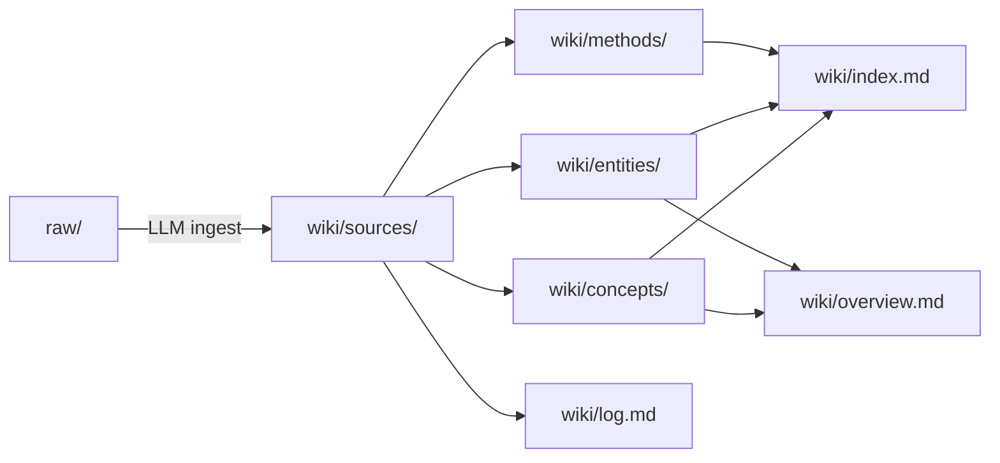

# karpathy-wiki

[English](README.md) · **简体中文**

> 一个以源头驱动的知识库，内容提炼自 Andrej Karpathy 的公开语料——X 帖、访谈、演讲、开源仓库和个人自述。
> **目的不是归档链接，而是理解这个人**——他如何思考、如何学习、如何工作、信奉什么、造出了什么，以及他对 AI 和软件工程都在说什么。

  

本仓库沿用 Karpathy 本人在 [LLM 知识库](wiki/sources/karpathy-x-2026-llm-wiki.md) 一文中勾勒的模式：原始素材放进 `raw/`（只读），LLM 把它编译进 `wiki/`（可读写、可自由重构），编译后的 wiki 再作为未来查询和追加素材的基底。

> [!IMPORTANT]
> 入口走 `wiki/`，不要走 `raw/`。[`wiki/overview.md`](wiki/overview.md) 是最高压缩的综述，[`wiki/index.md`](wiki/index.md) 是完整目录。

---

## 快速入口

| 我想…… | 从这里开始 |
|---|---|
| 看整体综述 | [wiki/overview.md](wiki/overview.md) |
| 读 Karpathy 的生平与代表作 | [wiki/entities/andrej-karpathy.md](wiki/entities/andrej-karpathy.md) |
| 浏览完整目录 | [wiki/index.md](wiki/index.md) |
| 了解维护协议 | [CLAUDE.md](CLAUDE.md) |
| 在 Obsidian 中阅读 | 把本目录作为 vault 打开 |

---

## 一、认识这个人

> "I like to train deep neural nets on large datasets 🧠🤖💥" —— karpathy.ai 个人简介

Karpathy 是当代 AI 领域**最能塑造范式**的人之一。他不发布最大的模型；他给我们的，是**用来思考这些模型的一整套词汇**——Software 3.0、人形灵体（people spirits）、动物与幽灵（animals vs ghosts）、认知内核（cognitive core）、九的长征（march of nines）……研究者、工程师、教师、公共思想者，这四顶帽子同时戴在一个人头上，几乎没有别人做到。

**职业轨迹**（[完整表格](wiki/entities/andrej-karpathy.md#career-arc-verified-dates-from-self-bio)）：

- 2005—2015：多伦多大学（上 Hinton 的课） → UBC → 斯坦福（Fei-Fei Li 门下）
- 2011 / 2013 / 2015：Google Brain → Google Research → DeepMind 实习
- 2015—2017：**OpenAI 创始成员**
- 2017—2022：**Tesla AI 总监**，带领 Autopilot 视觉团队
- 2023—2024：重回 OpenAI，做 midtraining 与合成数据
- 2024 至今：独立教育者；创办 [Eureka](wiki/entities/eureka.md)

还有两个传记层面的细节，能解释后来语料里非常多东西：

- **物理 / 硬件视角。** 多伦多阶段是 CS + physics + math；到 2025 年他回头说自己本科犯过一个错误：太重计算的数学视角，太轻物理视角，比如能耗、数据局部性、并行和体系结构。理解这点，就不难明白为什么 [llm.c](wiki/entities/llm-c.md)、CUDA kernel、系统层直觉会不断回到他的公开表达里。[andrej-karpathy](wiki/entities/andrej-karpathy.md) · [2025 杂项帖](wiki/sources/karpathy-x-2025-misc.md)
- **“ImageNet 的人类基准”。** 在 LLM 时代那套词汇框架之前，他在计算机视觉时代就已经有极高公信力；GPU MODE 主持人称他为 “the reference human for ImageNet”，这个标签很说明问题。它解释了为什么他后来谈 eval、自动驾驶和感知时，总带着一种不是空谈的底气。[andrej-karpathy](wiki/entities/andrej-karpathy.md) · [gpu-mode-irl-2024-keynote](wiki/sources/gpu-mode-irl-2024-keynote.md)

**他留下的东西：**
- [CS231n](wiki/entities/cs231n.md)——斯坦福第一门深度学习课，把一整代人送进了 DL 领域（2015 年 150 人 → 2017 年 750 人）
- [Zero to Hero](wiki/entities/zero-to-hero.md)——YouTube 上观看量最高的"从零开始理解神经网络"系列
- [nanoGPT](wiki/entities/nanogpt.md) / [nanochat](wiki/entities/nanochat.md) / [micrograd](wiki/entities/micrograd.md) / [llm.c](wiki/entities/llm-c.md) / [microGPT](wiki/entities/microgpt.md)——一套极简、可读性高、保真度高的教学代码阶梯
- Tesla FSD——2026-01-01 横贯美国 2,732 英里、零次接管，是 [Software 2.0](wiki/concepts/verifiability.md) 这笔赌注最干净的一次公开兑现

---

## 二、他如何思考

五个可以观察到的特点：

### 1. 先立框架
他会**造一个词**，然后把它当作推理的脚手架。这个词不是事后贴上去的标签——**词本身就是分析工具**。每个新造的词都自带一套类比、反例和演化边界。这是他影响力的技术内核。

完整造词清单见 [andrej-karpathy.md](wiki/entities/andrej-karpathy.md#karpathys-coinages-tracked-in-this-wiki)。最吃重的几个：

| 框架 | 它在回答什么问题 |
|---|---|
| [Software 1.0/2.0/3.0](wiki/concepts/software-3-0.md) | 软件是怎么写出来的？ |
| [动物与幽灵 / Animals vs Ghosts](wiki/concepts/animals-vs-ghosts.md) | LLM 到底是什么东西？ |
| [人形灵体 / People Spirits](wiki/concepts/people-spirits.md) | LLM 有哪些心理上的怪癖？ |
| [九的长征 / March of Nines](wiki/concepts/march-of-nines.md) | 为什么自动驾驶和 agent 都这么慢？ |
| [可验证性 / Verifiability](wiki/concepts/verifiability.md) | 哪些任务 AI 真能自动化？ |
| [认知内核 / Cognitive Core](wiki/concepts/cognitive-core.md) | "对的"模型该多大？ |
| [参差智能 / Jagged Intelligence](wiki/concepts/jagged-intelligence.md) | LLM 为什么时而天才、时而弱智？ |
| [验证缺口 / Verification Gap](wiki/concepts/verification-gap.md) | Agent 化编程的瓶颈在哪？ |

### 2. 类比驱动
- Tesla / Waymo 的自动驾驶曲线 → 编程 agent 接下来的走向
- 电影《记忆碎片》《初恋五十次》 → LLM 的会话级失忆
- 《雨人》 → 超人般的记忆叠加认知盲点
- 细菌的水平基因转移 → [细菌式代码](wiki/concepts/bacterial-code.md) 的可移植性
- 钢铁侠战衣对比钢铁侠机器人 → [增强优于自动化](wiki/concepts/iron-man-analogy.md)

类比并非装饰——而是他压缩**机制层面直觉**的方式。

### 3. 看斜率，不看点
他反复说：**眼下**"比人们预期悲观 5 到 10 倍"，**十年后**"比人们预期乐观 5 到 10 倍"（见 [Dwarkesh 2025 回顾](wiki/sources/karpathy-x-2025-dwarkesh-recap.md)）。他思考的是**导数**，不是瞬时值。

### 4. 不信榜单，信气味
2025 年他点名[排行榜幻觉](wiki/sources/karpathy-x-2025-evals-and-model-vibes.md)：基准分数已经和真实体验脱钩。他更相信"模型气味"（model smell）、[OpenRouter](wiki/entities/openrouter.md) 上的真实使用占比，以及多模型评议会（[llm-council](wiki/entities/llm-council.md)）。

### 5. 先替对立面说话
2026 年他把这条方法论说得很直白："**在下结论之前，我会强迫自己先把相反的立场论证一遍。**" 他把矛盾和不确定性当作信号保留，而不是抹平。这就是他公开的判断很少翻车的方法论根源（参见 [2026 Q1 X 帖](wiki/sources/karpathy-x-2026-agentic-engineering.md)）。

---

## 三、他如何学习

> "Pedagogy is a ramp, not a cliff."（教学是坡道，不是悬崖。——见 [知识坡道](wiki/concepts/ramps-to-knowledge.md)）

六条原则：

1. **[一万小时](wiki/concepts/10000-hours.md)。** 没有捷径。但坡道能把每小时的信息密度抬上去。
2. **[知识坡道](wiki/concepts/ramps-to-knowledge.md)。** 攻克任何复杂概念，都先写一份**极简但完整**的实现去啃：micrograd → nanoGPT → nanochat → llm.c。每上一级，剥掉一层脚手架，喂给下一级。
3. **动手才能感受**（[Feel the AGI](wiki/concepts/feel-the-agi.md)）。别读别人对 AGI 的评论——自己训一个小模型，看损失曲线往下走。这是他规定的**认知方式**，不是业余爱好。
4. **物理是启动盘。** "孩子应该尽早学物理，不是因为他们要去做物理，而是因为物理最能启动一颗大脑。物理学家是智识上的胚胎干细胞。"（见 [Dwarkesh 回顾](wiki/sources/karpathy-x-2025-dwarkesh-recap.md)）
5. **让 LLM 当第二读者，而不是第一读者**（[Reader3](wiki/entities/reader3.md) 工作流）。先自己读一遍原文；然后再让 LLM 讲解、补背景、唱反调——顺序不能反。这是抵御[技能萎缩（atrophy）](wiki/concepts/atrophy.md) 的堡垒。
6. **[把一切公开](wiki/concepts/snowballs.md)。** 课程、仓库、视频、帖子——全部公开、全部免费。飞轮（曝光 → 反馈 → 改进 → 更多曝光）本身就是全部意义。

---

## 四、他的世界观

七条硬立场，每一条都在多处语料中反复出现：

1. **LLM 是"幽灵"，不是"动物"。** 我们不是在重造生物智能；我们是在通过模仿人类文本**召唤一种数字实体**。所以别用评估动物的那一套来评估它；也别指望它长出本能驱动。出处见 [动物与幽灵](wiki/concepts/animals-vs-ghosts.md)。

2. **权力先落到个人手里**（2025-04-08 置顶帖，[Power to the People](wiki/sources/karpathy-x-2025-power-to-the-people.md)）。LLM 倒转了惯常的技术扩散路径——过去是军队 → 企业 → 消费者，这次是**个人最先受益**。原因：LLM 的能力形状（多领域、浅到中等专业度）正好贴合个人，不贴合组织。详见 [权力归于个人](wiki/concepts/power-to-the-people.md)。

3. **这是 agent 的十年，不是 agent 的一年。** 多数人把两年和十年这两个窗口弄反了：两年内悲观（没有炒作说得那么快），十年内乐观（比怀疑者以为的更深）。见 [Agent 的十年](wiki/concepts/decade-of-agents.md)。

4. **可验证性是 Software 2.0 的自动化前提**（2025-11-17）。"Software 1.0 自动化你**能说清楚**的事；Software 2.0 自动化你**能验证**的事。" 这是他 2025 年最吃重的一句话。出处见 [可验证性](wiki/concepts/verifiability.md)。

5. **[RLVR](wiki/concepts/rlvr.md) 是 2025 年 #1 的范式转变**——但 [强化学习依然糟糕](wiki/concepts/rl-is-terrible.md)，他的原话是"用吸管吸监督信号"（sucking supervision through a straw）。下一步应该是 [系统提示学习 / system prompt learning](wiki/concepts/system-prompt-learning.md)。

6. **能力分布是尖峰状、参差不齐的。** 进步并不均匀。一个好的评估，应该能告诉你**高峰在哪、凹陷在哪**。见 [尖峰能力](wiki/concepts/peaky-capability.md) 与 [参差智能](wiki/concepts/jagged-intelligence.md)。

7. **供应链是新的攻击面。** 他从 2025-07-11 起就借[提示词注入 / prompt injection](wiki/concepts/prompt-injection.md) 话题反复提醒；2026 年的 litellm 和 axios 事件证实了这个判断。[细菌式代码](wiki/concepts/bacterial-code.md) 的美学，和 [供应链攻击](wiki/concepts/supply-chain-attacks.md) 的忧虑，是同一枚硬币的两面。

---

## 五、他如何工作

- **[自主度滑杆](wiki/concepts/autonomy-slider.md)。** 产品和他自己的工作流都保留一个**可调的自主度**：Cursor 的 tab 补全（约 75% 的场景） → 划选局部让模型改 → [Claude Code](wiki/entities/claude-code.md) → GPT-5 Pro，随任务难度逐级往上滑。
- **[细菌式代码](wiki/concepts/bacterial-code.md)（bacterial code）。** 小、自足、无依赖、可一把抠走。他反对经典软件工程"依赖是砖块，我们在盖金字塔"的看法；在 LLM 时代，**引入一个依赖的成本／收益账已经变了**。
- **多 agent 并行 + IDE 手改**（2026-01-27 的 [agentic engineering](wiki/concepts/agentic-engineering.md)）。左边开几个 Claude Code 会话，右边用 IDE 读码、改码。这不是纯托管——是**编排 + 审查**。
- **[代码后稀缺](wiki/concepts/code-post-scarcity.md)**（2025-10-27）。写代码不再是最贵的环节。上千行的一次性可视化代码，用完就删——已经是日常。
- **[为 agent 而建](wiki/concepts/build-for-agents.md)。** Markdown 文档、CLI 优先、用 MCP 暴露能力。他的原话："LLM 是抓取型选手，不是导航型选手。"
- **把一切公开。** 没有私人 Google 文档。只有 X 帖、GitHub 仓库、YouTube 视频——他本人就是 [BYOAI](wiki/concepts/byoai.md) 理念的亲身实践。

---

## 六、偏好、习惯与行为特征

这一层是概念页最容易藏住的部分。Karpathy 的那些框架，下面其实垫着一套相当稳定的工具偏好、环境偏好和认知偏好。

- **偏爱低噪声环境。** 这种模式在 AI 里外都一致：更重视隐私保护的操作系统、更安静的居住环境、尽量少加工的食物、RSS 胜过算法信息流、对隐藏权限和隐藏攻击面高度警惕。他对“背景层面、看不见但持续恶化的噪声”非常敏感。[2025 杂项帖](wiki/sources/karpathy-x-2025-misc.md) · [供应链攻击](wiki/concepts/supply-chain-attacks.md)
- **文件优先于应用。** 他会反复选择 markdown、图片、本地文件、CLI、MCP、[Obsidian](wiki/concepts/llm-knowledge-bases.md)，而不是黑箱式 SaaS 界面。重点不是怀旧，而是可检查、可迁移、可审计、也更适合 agent 使用。[llm-knowledge-bases](wiki/concepts/llm-knowledge-bases.md) · [BYOAI](wiki/concepts/byoai.md) · [为 agent 而建](wiki/concepts/build-for-agents.md)
- **本地优先，但不反前沿。** 他喜欢“住在你电脑里”的 AI，能直接进入你的私有上下文和本地网络；但遇到最难的问题，他也毫不犹豫把任务路由给最强的 frontier 系统。稳定的偏好不是技术洁癖，而是让用户杠杆更大、锁定更小。[2025 AI 辅助编程](wiki/sources/karpathy-x-2025-ai-assisted-coding.md) · [BYOAI](wiki/concepts/byoai.md)
- **紧缰绳、可调自主度。** 他的默认姿态既不是“全信 agent”，也不是“全都自己写”。先问方案、再看取舍、把成功标准说清、让改动尽量增量化、并排审查；一旦模型开始过度思考，就主动把自主度往下拉。[2025 AI 辅助编程](wiki/sources/karpathy-x-2025-ai-assisted-coding.md) · [agentic engineering](wiki/concepts/agentic-engineering.md)
- **真正稀缺的是品味。** 他多次指出 agent 会过度抽象、滥用 try/catch、过度工程化、留下死代码。这也是为什么 [细菌式代码](wiki/concepts/bacterial-code.md) 和 [代码后稀缺](wiki/concepts/code-post-scarcity.md) 能同时成立：代码本身变便宜了，但判断“什么值得存在”依然昂贵。
- **公开思考，让作品自己滚雪球。** X 帖、仓库、gist、视频、公开课、周末 demo，以及现在这种个人 wiki。他明显更偏爱能持续积累的公开制品，而不是会消失的私有笔记。[项目雪球](wiki/concepts/snowballs.md) · [llm-knowledge-bases](wiki/concepts/llm-knowledge-bases.md)
- **偏爱“看得见工艺”的作品。** 就算是看起来离题的帖子也很说明问题：Tolkien、*White Lotus*、*Project Hail Mary*、解释型工具、动画图解、research app。他往往偏爱结构清晰、工艺密集、内部可分析的作品。[2025 杂项帖](wiki/sources/karpathy-x-2025-misc.md) · [2026 杂项帖](wiki/sources/karpathy-x-2026-misc.md)

---

## 七、他做成了什么

### 六个贡献领域

1. **让计算机视觉走进课堂**——CS231n（2015—2017）；他也是斯坦福 ImageNet 工作的一线主力（著名的"ImageNet 人类基准"就是他本人）。
2. **自动驾驶的 Software 2.0 化**——Tesla Autopilot 2017—2022，一层一层把 C++ 模块换成神经网络。2026-01-01 横贯美国就是这条战略的公开兑现。
3. **打开 LLM 训练栈**——[nanoGPT](wiki/entities/nanogpt.md) / [nanochat](wiki/entities/nanochat.md) / [llm.c](wiki/entities/llm-c.md) 把前沿训练变成可读、可复现、100 美元以内就能跑完的练习。
4. **Midtraining 与合成数据**（OpenAI 2023—24）——公开语料里没细讲，但能在侧影里看到（比如 nanochat 的身份注入配方，见 [10.21](wiki/sources/karpathy-x-2025-nanochat-saga.md)）。
5. **塑造行业词汇**——Software 3.0、人形灵体、动物与幽灵、vibe coding、agentic engineering、细菌式代码、BYOAI。六七个词已经成了行业通用语。
6. **重启 AI 教育**——[Eureka](wiki/entities/eureka.md)，他本人形容为"心智版的星舰学院"；目标是把"知识坡道"这套范式推广成公共基础设施。

### 关键时间节点

- **2025-04-08** [Power to the People](wiki/sources/karpathy-x-2025-power-to-the-people.md)——"扩散倒转论"
- **2025-07-06** [细菌式代码](wiki/sources/karpathy-x-2025-bacterial-code-origin.md)——造词首发
- **2025-07-27** [认知内核](wiki/sources/karpathy-x-2025-cognitive-core.md)——完整规格
- **2025-10-13** [nanochat](wiki/sources/karpathy-x-2025-nanochat-saga.md) 发布
- **2025-11-17** [可验证性](wiki/sources/karpathy-x-2025-software-paradigm.md)——定音之句
- **2025-12-20** [年度回顾](wiki/sources/karpathy-x-2025-software-paradigm.md)——宣告 [RLVR](wiki/concepts/rlvr.md) 为年度 #1 范式转变
- **2026-01-01** [Tesla FSD 横贯美国](wiki/sources/karpathy-x-2026-fsd-coast-to-coast.md)（2,732 英里，0 次干预）
- **2026-01-27** [Claude 编程札记](wiki/sources/karpathy-x-2026-claude-coding-reflections.md)——[技能萎缩 / atrophy](wiki/concepts/atrophy.md) 被正式命名
- **2026-02-05** [Agentic engineering](wiki/concepts/agentic-engineering.md)——造词
- **2026-02-25** 明说"**相变发生在 2025 年 12 月**"（见 [2026 Q1 X 帖](wiki/sources/karpathy-x-2026-agentic-engineering.md)）
- **2026-04-05** [BYOAI](wiki/concepts/byoai.md)——个人 AI 栈立场

---

## 八、对 AI 与软件工程的看法

这是你每天最可能用到的一层。九根支柱：

1. **[Software 3.0](wiki/concepts/software-3-0.md)。** 提示词是新的源代码；英语是新的编程语言。但写代码是最容易的环节——难的是**把 DevOps 打通**（[MenuGen 用了整整一周才上线](wiki/concepts/vibe-coding.md)）。
2. **[半自主应用](wiki/concepts/partial-autonomy-apps.md)。** 下一代产品形态：带[自主度滑杆](wiki/concepts/autonomy-slider.md)的半自主应用。Cursor、Perplexity、Claude Code、Codex 都是早期范例。
3. **[为 agent 而建](wiki/concepts/build-for-agents.md)。** Markdown 文档、CLI、API、[MCP](wiki/entities/model-context-protocol.md)；`llms.txt`；把 [LLM GUI](wiki/concepts/llm-gui.md) 视为**尚未建成但可预见**的前端范式。
4. **[Agentic Engineering](wiki/concepts/agentic-engineering.md)。** Vibe coding 的专业化版本。2025 年 12 月是那道门槛：之前 coding agent 基本不 work，之后基本能 work。
5. **[验证缺口](wiki/concepts/verification-gap.md)。** 生成便宜，验证昂贵——这是新的瓶颈。问题不在代码量不够，而在**审核的吞吐跟不上**。一个副作用就是 [技能萎缩](wiki/concepts/atrophy.md)：生成肌肉先萎缩，审查肌肉还没长出来。
6. **[代码后稀缺](wiki/concepts/code-post-scarcity.md)。** 代码便宜到可以一次性、可丢弃。过去关于"别重复自己（DRY）／早做抽象／写辅助函数"的直觉，**在一次性场景里全都反转**。
7. **[上下文工程](wiki/concepts/context-engineering.md)。** "提示词工程"的后继概念——上下文的选取、压缩、排序、记忆、工具使用。范围更大，也更偏工程。
8. **[细菌式代码](wiki/concepts/bacterial-code.md) × [供应链攻击](wiki/concepts/supply-chain-attacks.md)。** 2026 年的 litellm / axios 事件把道理挑明了：**依赖越少，攻击面越小**。LLM 让"把代码抠出来内联进自己项目"比"`pip install` 拉一个包"更划算。
9. **[BYOAI](wiki/concepts/byoai.md)。** 你的 AI 栈应该在**你这一侧**——能本地跑、能换模型、能扛得住[智能降载 / intelligence brownouts](wiki/concepts/intelligence-brownouts.md)。自然的延伸就是[认知内核 / cognitive core](wiki/concepts/cognitive-core.md)：小、以推理为主、会用工具。

对着 [wiki/overview.md](wiki/overview.md#central-claims-across-the-corpus) 里的 11 条中心主张一起读，就能拿到同一故事的最压缩版本。

---

## 九、几组关键张力

Karpathy 之所以显得立体，不是因为他的语料平整无冲突，恰恰相反：有几组张力会反复出现，而且他是有意不把它们消解掉的。

- **极大赋能，极小信任。** 他非常希望普通个体借助 AI 获得巨大杠杆，但又不断提醒 prompt injection、供应链投毒、隐藏记忆、默认过度 agent 化这些风险。他是激进地支持使用，不是天真地支持托管。
- **对斜率乐观，对当下不耐烦。** 他在 10 年尺度上结构性看多，但对当前的 UX、可靠性、验证链条又经常很不满意。所以他的表达总会同时带着兴奋和嫌弃。
- **代码丰裕，品味稀缺。** 他相信代码已经变得便宜、可丢弃，但好结构、好清理、好拆解、好审查反而比以前更重要。稀缺性没有消失，只是换了位置。
- **本能公开，但筛选严格。** 他几乎什么都公开发，但明显偏爱开放格式、RSS、markdown、CLI 接口、带来源锚点的语料，而不是算法信息流或黑箱产品。
- **小而本地的审美，同时又高度前沿感知。** 他喜欢小而自足的制品、本地优先的工作方式、认知内核这类“小模型 + 工具”的方向；与此同时，他又会非常敏锐地追踪 frontier 模型质量，并在需要时直接使用最强系统。

---

## 仓库结构

| 路径 | 作用 |
|---|---|
| `raw/` | 不可变的原始素材（X 帖、转录、自述） |
| `raw/2025/` · `raw/2026/` | 按年份组织的 X 帖语料 |
| `raw/youtube-transcript/` | 长访谈和演讲的转录 |
| `wiki/sources/` | 每个源（或捆绑源）的忠实摘要 |
| `wiki/concepts/` | 跨源的概念页 |
| `wiki/entities/` | 人／组织／产品／项目／课程 |
| `wiki/methods/` | 算法与技术页 |
| `wiki/index.md` | 完整目录 |
| `wiki/log.md` | ingest／lint／重构的审计日志 |
| `wiki/overview.md` | 最高压缩的综述 |
| `CLAUDE.md` | 面向 LLM 的维护协议 |

**工作流：**

## 当前覆盖

截至 2026-04-18：

| 层 | 数量 |
|---|---:|
| 原始 markdown 文件 | 109 |
| 源摘要页 | 31 |
| 概念页 | 50 |
| 实体页 | 43 |
| 方法页 | 1 |

**已覆盖：** 2024 基础素材（Berkeley／GPU MODE） · 2025 全年 X 帖弧（16 个主题捆绑） · 2026 截至 4 月的 X 帖弧（10 个主题捆绑） · 自述和长访谈转录。

`raw/` 和 `wiki/sources/` 并非一对一——高密度的短帖被**按主题聚合**为捆绑源页，以对齐 Karpathy 实际展开思想的颗粒度。

---

## 怎么用

- **当 wiki 来读。** 把仓库作为 Obsidian vault 打开，用 graph view 看概念之间的邻接关系。
- **往里加东西。** 要 ingest 新素材，按 [CLAUDE.md](CLAUDE.md) 里的 ingest 协议来做。
- **对它发问。** 查询对准 `wiki/`，不要对准 `raw/`——前者是已编译、已交叉链接的版本；后者还是未处理的信息洪流。
- **拿来写作或思考。** 每个概念页的 `## Related` 给出它的邻域；[wiki/overview.md](wiki/overview.md) 给出大局。
- **当时间线读。** [log.md](wiki/log.md) 按时间顺序记录 wiki 自身的演化——每一次 ingest、lint、重构都留了痕。

> [!TIP]
> **5 分钟：** 读 [wiki/overview.md](wiki/overview.md)。
> **30 分钟：** 加读 [wiki/entities/andrej-karpathy.md](wiki/entities/andrej-karpathy.md) 和 [wiki/concepts/software-3-0.md](wiki/concepts/software-3-0.md)。
> **一整天：** 按本 README 前九个章节依次走一遍。

---

以 [`llm-wiki-bootstrap`](https://github.com/nanzhipro/Karpathy-llm-wiki-bootstrap-skill) 脚手架起步；围绕 69+ 则 2025 X 帖、15+ 则 2026 X 帖、4 场长访谈／演讲，以及 karpathy.ai 自述大幅扩展而成。
