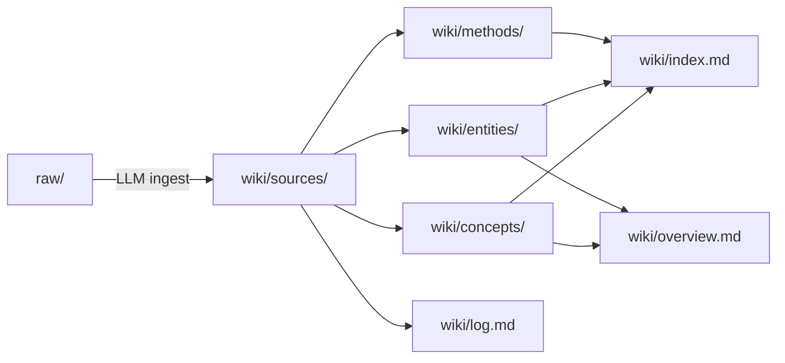

# karpathy-wiki

[English](README.md) · **简体中文**

> 一部以 Andrej Karpathy 公开语料——X 帖、访谈、演讲、开源仓库、自述——为本源，经编译、互链而成的知识库。
> **意不在存档链接，而在理解其人**：他如何思考、如何学习、如何工作、所信为何、已成何事，以及他对 AI 与软件工程的诸般判断。

本仓库沿用 Karpathy 在 [LLM 知识库](wiki/sources/karpathy-x-2026-llm-wiki.md) 一文中所勾勒的范式——原始素材落于 `raw/`（只读），交由 LLM 编译进 `wiki/`（可读写、可反复重构），编译之后的 wiki 又成为后续查询与追加的基底。

> [!IMPORTANT]
> 入口恒在 `wiki/`，而非 `raw/`。[`wiki/overview.md`](wiki/overview.md) 是最高压缩的合成版，[`wiki/index.md`](wiki/index.md) 是完整目录。

---

## 快速入口

| 欲…… | 起始于此 |
|---|---|
| 通观全局 | [wiki/overview.md](wiki/overview.md) |
| 读其生平与代表作 | [wiki/entities/andrej-karpathy.md](wiki/entities/andrej-karpathy.md) |
| 查完整目录 | [wiki/index.md](wiki/index.md) |
| 了解维护流程 | [CLAUDE.md](CLAUDE.md) |
| 在 Obsidian 中浏览 | 将本目录作为 Vault 打开 |

---

## 一、其人

> "I like to train deep neural nets on large datasets 🧠🤖💥" —— karpathy.ai 自述

Karpathy 是当代 AI 界**最具范式塑造力**的个体之一。他不做最大的模型，却给了我们用以理解这些模型的**语汇**——Software 3.0、people spirits、animals vs ghosts、cognitive core、march of nines……研究者、工程师、教师、公共思想者，这四顶帽子同时戴在一个人头上的情形殊为罕见，他是例外。

**职业轨迹**（[完整表格](wiki/entities/andrej-karpathy.md#career-arc-verified-dates-from-self-bio)）：

- 2005—2015：多伦多（Hinton 的课） → UBC → 斯坦福（Fei-Fei Li 门下）
- 2011 / 2013 / 2015：Google Brain → Google Research → DeepMind 实习
- 2015—2017：**OpenAI 创始成员**
- 2017—2022：**特斯拉 AI 总监**，执掌 Autopilot 视觉团队
- 2023—2024：回到 OpenAI，主理 midtraining 与合成数据
- 2024— ：独立教育者，创办 [Eureka](wiki/entities/eureka.md)

**其所留下者**：
- [CS231n](wiki/entities/cs231n.md)——斯坦福第一门深度学习课，把一代人送进 DL 之门（2015 年 150 人 → 2017 年 750 人）
- [Zero to Hero](wiki/entities/zero-to-hero.md)——YouTube 上最具影响力的"从零理解神经网络"系列
- [nanoGPT](wiki/entities/nanogpt.md) / [nanochat](wiki/entities/nanochat.md) / [micrograd](wiki/entities/micrograd.md) / [llm.c](wiki/entities/llm-c.md) / [microGPT](wiki/entities/microgpt.md)——最小可读、最高保真的教学代码阶梯
- 特斯拉 FSD——2026-01-01 横穿美国 2,732 英里、零次接管,即 [Software 2.0](wiki/concepts/verifiability.md) 赌注最干净的一次兑现

---

## 二、他如何思考

可观测的五条特征：

### 1. 框架先行
他惯于**先造一个词**，再以此为推理的脚手架。词不是事后贴上的标签——**词本身就是分析工具**。每个 coinage 都自带类比、反例、演化边界。这是他影响力的技术内核。

完整 coinage 列表见 [andrej-karpathy.md](wiki/entities/andrej-karpathy.md#karpathys-coinages-tracked-in-this-wiki)。最承重的几枚：

| 框架 | 所欲回答 |
|---|---|
| [Software 1.0/2.0/3.0](wiki/concepts/software-3-0.md) | 软件是如何被写出来的？ |
| [Animals vs Ghosts](wiki/concepts/animals-vs-ghosts.md) | LLM 究竟是什么东西？ |
| [People Spirits](wiki/concepts/people-spirits.md) | LLM 有何心理特征？ |
| [March of Nines](wiki/concepts/march-of-nines.md) | 自动驾驶与 agent 为何如此之慢？ |
| [Verifiability](wiki/concepts/verifiability.md) | 哪类任务可被 AI 真正自动化？ |
| [Cognitive Core](wiki/concepts/cognitive-core.md) | "对的"模型应该多大？ |
| [Jagged Intelligence](wiki/concepts/jagged-intelligence.md) | LLM 为何时而天才、时而白痴？ |
| [Verification Gap](wiki/concepts/verification-gap.md) | agentic 编程的瓶颈在何处？ |

### 2. 类比驱动
- 特斯拉 / Waymo 的自动驾驶曲线 → coding agent 即将走的路
- *Memento* / *50 First Dates* → LLM 的会话级遗忘
- *Rain Man* → 超人记忆与认知短板并存
- 细菌的水平基因转移 → [细菌式代码](wiki/concepts/bacterial-code.md) 的可移植性
- 钢铁侠战衣 vs 钢铁侠机器人 → [增强高于自动化](wiki/concepts/iron-man-analogy.md)

类比不是装饰——是他压缩**机制级直觉**的方式。

### 3. 斜率，而非点值
他反复说：当下"比人们预期**悲观** 5 到 10 倍"，十年后"比人们预期**乐观** 5 到 10 倍"（[Dwarkesh 2025 recap](wiki/sources/karpathy-x-2025-dwarkesh-recap.md)）。他关心的是**导数**，不是瞬时值。

### 4. 疑基准，信 vibe
2025 年他点名[排行榜幻觉](wiki/sources/karpathy-x-2025-evals-and-model-vibes.md)：benchmark 分数已与实际体验脱钩。他更信**model smell**、[OpenRouter](wiki/entities/openrouter.md) 的真实使用占比、以及多模型 council（[llm-council](wiki/entities/llm-council.md)）。

### 5. 反证为习
2026 年他明言："**下结论之前，我会强迫自己论证相反方向。**"矛盾与不确定性当作信号保留，不予抹平。这也是他的公开判断鲜少被打脸的方法论根源。

---

## 三、他如何学习

> "Pedagogy is a ramp, not a cliff."（教学是一道坡，不是一面崖。）

六条原则：

1. **[一万小时](wiki/concepts/10000-hours.md)**。没有捷径。但坡道能抬高每小时的信息密度。
2. **[知识之坡](wiki/concepts/ramps-to-knowledge.md)**。攻克任何复杂概念，都要先写一份**极小而完整**的实现：micrograd → nanoGPT → nanochat → llm.c。每上一阶，剥去一层脚手架，喂给下一阶。
3. **动手以感之**（[Feel the AGI](wiki/concepts/feel-the-agi.md)）。别读别人写的 AGI 论断，自己训一个小模型，看 loss 曲线如何下降——这不是爱好，是他所规定的**认知方式**。
4. **物理是启动盘**。"孩子应当尽早学习物理,不是为了日后从事物理,而是因为物理最能启动一副大脑。物理学家是智识上的胚胎干细胞。"（[Dwarkesh recap](wiki/sources/karpathy-x-2025-dwarkesh-recap.md)）
5. **LLM 作第二读者，不作第一读者**（[Reader3](wiki/entities/reader3.md) 工作流）。先自己读一遍原文；再让 LLM 讲解、补背景、唱反调——顺序不可颠倒。这是抵御 [atrophy](wiki/concepts/atrophy.md) 的堡垒。
6. **[发布一切](wiki/concepts/snowballs.md)**。课程、仓库、视频、帖子——全部公开、全部免费。飞轮（曝光 → 反馈 → 改进 → 再曝光）才是重点。

---

## 四、他的世界观

七条硬立场，每条皆在多处语料中反复出现：

1. **LLM 是 ghost，不是 animal**。我们并非在复刻生物智能——我们是**以模仿人类文本的方式召唤一种数字实体**。故不可套用动物评估；亦勿期其自发生出本能驱动。[animals-vs-ghosts](wiki/concepts/animals-vs-ghosts.md)

2. **Power to the people**（2025-04-08 顶帖）。LLM 反转了惯常的技术扩散路径——过去是军队→企业→消费者，这次却是**个人先受益**。缘由在于：LLM 的能力形状（多领域、浅至中等专业度）恰匹配个人，不匹配组织。[power-to-the-people](wiki/concepts/power-to-the-people.md)

3. **十年之事，非一年之事**。多数人把两年和十年的视角颠倒了：两年内**悲观**（它没炒作说的那么快），十年内**乐观**（它比怀疑者以为的更深）。[decade-of-agents](wiki/concepts/decade-of-agents.md)

4. **可验证性即 Software 2.0 的自动化前提**（2025-11-17）。"Software 1.0 自动化你**能指明**之事；Software 2.0 自动化你**能验证**之事。"这是他 2025 年最承重的一句。[verifiability](wiki/concepts/verifiability.md)

5. **[RLVR](wiki/concepts/rlvr.md) 是 2025 年 #1 范式转变**——**而** [RL 依旧糟糕](wiki/concepts/rl-is-terrible.md)（"用吸管汲取监督信号"）。下一步应是 [system prompt learning](wiki/concepts/system-prompt-learning.md)。

6. **能力分布是 peaky / jagged 的**。进步不均匀；好的评估要看出**峰在何处、坑在何处**。[peaky-capability](wiki/concepts/peaky-capability.md) · [jagged-intelligence](wiki/concepts/jagged-intelligence.md)

7. **供应链即新的攻击面**。自 2025-07-11 起即多次以 [prompt injection](wiki/concepts/prompt-injection.md) 之名相提醒；2026 年 litellm、axios 等事件坐实了他的判断。[细菌式代码](wiki/concepts/bacterial-code.md) 的美学与 [供应链攻击](wiki/concepts/supply-chain-attacks.md) 的忧虑是同一枚硬币的两面。

---

## 五、他如何工作

- **[自主度滑杆](wiki/concepts/autonomy-slider.md)**：产品与个人工作流都保留**可调的自主度**。Cursor tab（约 75% 场景） → highlight-edit → [Claude Code](wiki/entities/claude-code.md) → GPT-5 Pro，随任务难度逐级滑动。
- **[细菌式代码](wiki/concepts/bacterial-code.md)**：小、独立、无依赖、可 yoink。他拒斥"依赖是砖、我们在盖金字塔"的古典软工观——在 LLM 时代，**依赖的成本/收益已然反转**。
- **多 agent 并行 + IDE 手改**（[agentic engineering](wiki/concepts/agentic-engineering.md)，2026-01-27）：左侧数个 Claude Code session，右侧 IDE 读码与改码。不是纯托管,而是**编排 + 审查**。
- **[代码后稀缺](wiki/concepts/code-post-scarcity.md)**（2025-10-27）：写代码不再昂贵；千行级一次性可视化代码用毕即弃——已属日常。
- **[为 agent 而建](wiki/concepts/build-for-agents.md)**：markdown 文档、CLI 优先、MCP 暴露能力。"LLM 只抓取，不导航。"
- **公开一切**：不写私人 Google Doc，只发 X 帖 + GitHub repo + YouTube 视频——其人即是 [BYOAI](wiki/concepts/byoai.md) 理念的亲身践行。

---

## 六、他的建树

### 六大贡献领域

1. **将计算机视觉教学化**——CS231n（2015—2017）与斯坦福 ImageNet 工作的一线力量（著名的"ImageNet 人类基准"即他本人）。
2. **自动驾驶的 Software 2.0 化**——特斯拉 Autopilot 2017—2022，逐层把 C++ 模块换成神经网络。2026-01-01 横穿美国零接管即此战略的公开兑现。
3. **大模型训练栈的开放化**——[nanoGPT](wiki/entities/nanogpt.md) / [nanochat](wiki/entities/nanochat.md) / [llm.c](wiki/entities/llm-c.md)，把前沿训练方法化为可读、可复现、百美元以内的作业。
4. **Midtraining 与合成数据**（OpenAI 2023—24）——未在公开语料中细描，但在投影中可见（如 nanochat 的身份注入配方，见 [10.21](wiki/sources/karpathy-x-2025-nanochat-saga.md)）。
5. **塑造公共语汇**——Software 3.0、people spirits、animals vs ghosts、vibe coding、agentic engineering、bacterial code、BYOAI……至少六七个词已成业内通用语。
6. **重启 AI 教育**——[Eureka](wiki/entities/eureka.md)（"智识上的星舰学院"），志在把 ramps-to-knowledge 范式推广为通用 AI 教育基础设施。

### 关键时间节点

- **2025-04-08** [Power to the People](wiki/sources/karpathy-x-2025-power-to-the-people.md)——扩散反转论
- **2025-07-06** [Bacterial code](wiki/sources/karpathy-x-2025-bacterial-code-origin.md) coinage
- **2025-07-27** [Cognitive core](wiki/sources/karpathy-x-2025-cognitive-core.md) 完整 spec
- **2025-10-13** [nanochat](wiki/sources/karpathy-x-2025-nanochat-saga.md) 发布
- **2025-11-17** [Verifiability](wiki/sources/karpathy-x-2025-software-paradigm.md) 定音之句
- **2025-12-20** [年终回顾](wiki/sources/karpathy-x-2025-software-paradigm.md)——宣告 [RLVR](wiki/concepts/rlvr.md) 为年度 #1 范式变化
- **2026-01-01** [特斯拉 FSD 横穿美国](wiki/sources/karpathy-x-2026-fsd-coast-to-coast.md)（2,732 英里，0 次干预）
- **2026-01-27** [Claude 编程札记](wiki/sources/karpathy-x-2026-claude-coding-reflections.md)——[atrophy](wiki/concepts/atrophy.md) 正式命名
- **2026-02-05** [Agentic engineering](wiki/concepts/agentic-engineering.md) coinage
- **2026-02-25** 明言"**相变发生于 2025 年 12 月**"
- **2026-04-05** [BYOAI](wiki/concepts/byoai.md)——个人 AI 栈之主张

---

## 七、他对 AI 与软件工程的见解

此层大约是你最可能每日用到的。九根支柱：

1. **[Software 3.0](wiki/concepts/software-3-0.md)**：prompt 是新的源代码，英语是新的编程语言。但写代码已是最简单的环节——难的是**打通 DevOps**（[MenuGen 耗一周方才上线](wiki/concepts/vibe-coding.md)）。
2. **[半自主应用](wiki/concepts/partial-autonomy-apps.md)**：下一代产品形态——带 [自主度滑杆](wiki/concepts/autonomy-slider.md) 的半自主应用。Cursor、Perplexity、Claude Code、Codex 皆是早期范例。
3. **[为 agent 而建](wiki/concepts/build-for-agents.md)**：markdown 文档、CLI、API、[MCP](wiki/entities/model-context-protocol.md)；`llms.txt`；[LLM GUI](wiki/concepts/llm-gui.md) 作为**尚未建成、但可预见**的前端范式。
4. **[Agentic Engineering](wiki/concepts/agentic-engineering.md)**：vibe coding 的专业化版本。2025 年 12 月是其门槛——此前 coding agent 基本不 work，此后基本 work。
5. **[验证缺口](wiki/concepts/verification-gap.md)**：生成廉价、验证昂贵——这是新的瓶颈。问题不在代码不够多，而在**审核跟不上**。一个副作用即 [atrophy](wiki/concepts/atrophy.md)——生成肌肉先行萎缩，审查肌肉尚未长成。
6. **[代码后稀缺](wiki/concepts/code-post-scarcity.md)**：代码廉价到足以一次性、可丢弃。旧有的 DRY / 早抽象 / 写 helper 的直觉**在 throwaway 场景下反转**。
7. **[上下文工程](wiki/concepts/context-engineering.md)**：取代"prompt engineering"的后继概念——上下文选取、压缩、排列、记忆、工具。更宽、更运营化。
8. **[细菌式代码](wiki/concepts/bacterial-code.md) × [供应链攻击](wiki/concepts/supply-chain-attacks.md)**：2026 年的 litellm / axios 事件已说明一切——**依赖少即攻击面少**。LLM 让 "yoink + inline" 比 "pip install" 更合算。
9. **[BYOAI](wiki/concepts/byoai.md)**：你的 AI 栈应在**你这一侧**——可本地运行、可更换模型、可抵 [智力降载](wiki/concepts/intelligence-brownouts.md)。其自然延伸即 [cognitive core](wiki/concepts/cognitive-core.md)：小而以推理为先，会用工具。

配合 [wiki/overview.md](wiki/overview.md#central-claims-across-the-corpus) 中 11 条中心主张同读，可得同一故事的最压缩版本。

---

## 仓库结构

| 路径 | 作用 |
|---|---|
| `raw/` | 不可变的原始素材（X 帖、转录、自述等） |
| `raw/2025/` · `raw/2026/` | 按年份组织的 X-post 语料 |
| `raw/youtube-transcript/` | 长访谈与演讲转录 |
| `wiki/sources/` | 每源（或按捆绑）的忠实摘要 |
| `wiki/concepts/` | 跨源抽象的概念页 |
| `wiki/entities/` | 人 / 组织 / 产品 / 项目 / 课程 |
| `wiki/methods/` | 方法 / 算法页 |
| `wiki/index.md` | 完整目录 |
| `wiki/log.md` | ingest / lint / 重构的审计日志 |
| `wiki/overview.md` | 最高压缩的合成版 |
| `CLAUDE.md` | LLM 维护协议 |

**工作流**：

## 当前覆盖

截至 2026-04-18：

| 层 | 数量 |
|---|---:|
| 原始 markdown 文件 | 109 |
| 源摘要页 | 31 |
| 概念页 | 50 |
| 实体页 | 43 |
| 方法页 | 1 |

**已覆盖**：2024 基础素材（Berkeley / GPU MODE）· 2025 全年 X-post 弧（16 主题捆绑）· 2026 截至 4 月 X-post 弧（10 主题捆绑）· 自述与长访谈转录。

`raw/` 与 `wiki/sources/` 并非一对一——高密度短帖被**按主题聚合**为捆绑源页，以匹配 Karpathy 实际展开思想的粒度。

---

## 使用建议

- **作 wiki 阅读**：以本仓库为 Obsidian Vault 打开，借 graph view 观察概念之间的邻接。
- **追加素材**：若要 ingest 新素材，遵循 [CLAUDE.md](CLAUDE.md) 中的 ingest 协议。
- **作为查询基底**：查询面向 `wiki/`，而非 `raw/`——前者已编译、已交叉链接，后者尚是未处理的信息洪流。
- **作为写作 / 思考参考**：每个概念页的 `## Related` 列出该概念的邻域；[wiki/overview.md](wiki/overview.md) 给出大局。
- **作为时间线**：[log.md](wiki/log.md) 按时间顺序记录 wiki 自身的演化——每次 ingest / lint / 重构皆留痕。

> [!TIP]
> **5 分钟**：读 [wiki/overview.md](wiki/overview.md)。
> **30 分钟**：加读 [wiki/entities/andrej-karpathy.md](wiki/entities/andrej-karpathy.md) 与 [wiki/concepts/software-3-0.md](wiki/concepts/software-3-0.md)。
> **一整天**：按本 README 七大主题逐一展开。

---

基于 [`llm-wiki-bootstrap`](https://github.com/nanzhipro/Karpathy-llm-wiki-bootstrap-skill) 脚手架扩展而成；围绕 69+ 则 2025 X 帖、15+ 则 2026 X 帖、4 场长访谈/演讲、以及 karpathy.ai 自述大幅展开。
